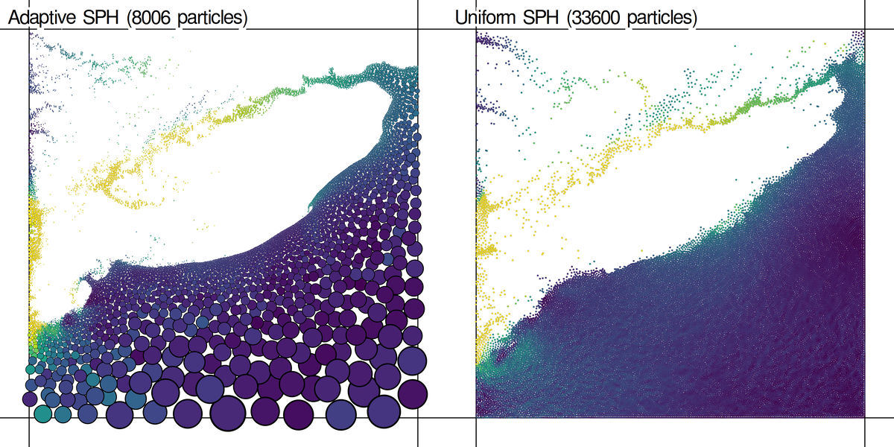

# Adaptive SPH

This project is the accompanying project to my master thesis about fluid simulation with Smoothed-particle hydrodynamics (SPH) using adaptive particle sizes.

**[You can try it in your browser here.](https://kaegi.github.io/adaptive-sph/)**



Special thanks to *Rene Winchenbach* and his collegues, as this project is based upon their research (also see [openMaelstrom](https://github.com/wi-re/openMaelstrom)).

## How to build & run

In the root of this project run:

```bash
cargo run --release -- run default-config.yaml default-scene.yaml
```

To create images and videos that are used in the thesis (and the image above) with the Cairo library, use the subcommand `image <simulation-config>`:

```bash
# creates image `media/ratio-stress-test.png`
cargo run --release -- image media/ratio-stress-test.yaml
```

## Compiling for web

```bash
cargo install wasm-pack
wasm-pack build --target web --out-dir ./web/wasm

# hosting locally at `localhost:8000`
python -m http.server --directory web
```

